# Sistema Académico de Avance Curricular

Proyecto desarrollado para el curso de **Programación Avanzada**. Consiste en un sistema de gestión académica robusto que permite administrar alumnos, docentes y sus respectivas cargas académicas, cumpliendo con estándares de arquitectura orientada a objetos en Java.

##  Instalación y Ejecución

### 1. Requisitos Previos
Para ejecutar este sistema, asegúrese de tener instalado:
* **Java JDK:** Versión 17 o superior.
* **IDE Recomendado:** NetBeans (facilita la gestión de proyectos Ant y la generación de Javadoc).
* **Sistema Operativo:** Windows, macOS o Linux.
---
### 2. Estructura de Datos
El proyecto utiliza persistencia en modo **batch** (carga al inicio y guardado al cierre). Requiere que los siguientes archivos `.txt` estén en la raíz del proyecto para funcionar correctamente:
* `alumnos.txt`: Registro base de estudiantes.
* `profesores.txt`: Registro base de docentes.
* `asignaturas_alumnos.txt`: Relación de materias y estados académicos.
* `asignaturas_profesores.txt`: Relación de materias dictadas por docentes.

---

## Documentación Técnica (Javadoc)
Este proyecto cumple con el requerimiento **SIA-O3**, contando con documentación técnica detallada de cada clase y método. 

Para visualizarla:
1. Vaya a la carpeta `dist/javadoc/`.
2. Abra el archivo **`index.html`** en su navegador favorito.

---

## Instrucciones de Uso

Al iniciar, el sistema permite elegir entre dos interfaces de usuario:
1. **Modo Consola:** Interfaz de texto optimizada para visualización rápida de datos.
2. **Modo Ventana:** Interfaz gráfica basada en `JOptionPane` para una gestión intuitiva (SIA-12).
---
### Funcionalidades destacadas:
* **Gestión de Alumnos:** Inserción, edición, eliminación y búsqueda avanzada.
* **Análisis de Rendimiento (KPI):** Cálculo de progreso curricular y rendimiento promedio por carrera (SIA-9).
* **Gestión de Profesores:** Asignación de carga académica y filtros por especialidad.
* **Manejo de Errores:** Implementación de excepciones personalizadas (`AtributoInvalidoException` y `EntidadNoEncontradaException`) para asegurar la integridad de los datos.

```mermaid
classDiagram

    %% ==========================================
    %% CAPA DE PRESENTACIÓN / INTERFAZ
    %% ==========================================

    class Main {
        +main(String[] args)$ void
    }

    class MenuConsola {
        -Scanner scanner
        +MenuConsola()
        +mostrarMenu(RegistroAlumnos registroAlumnos, RegistroProfesores registroProfesores) void
        -menuAlumnos(RegistroAlumnos registroAlumnos) void
        -menuProfesores(RegistroProfesores registroProfesores) void
        -gestionarAsignaturasProfesor(RegistroProfesores registroProfesores) void
        -gestionarAsignaturasAlumno(RegistroAlumnos registroAlumnos) void
        -asignarNuevaAsignatura(Profesor profesor) void
        -verAsignaturasProfesor(Profesor profesor) void
        -editarAsignaturaProfesor(Profesor profesor) void
        -eliminarAsignaturaProfesor(Profesor profesor) void
        -buscarAsignaturaProfesor(Profesor profesor) void
        -agregarAsignaturaMalla(Alumno alumno) void
        -mostrarMallaAlumno(Alumno alumno) void
        -modificarEstadoAsignatura(Alumno alumno) void
        -eliminarAsignaturaMalla(Alumno alumno) void
        -buscarAsignaturaMalla(Alumno alumno) void
        -agregarAlumno(RegistroAlumnos registroAlumnos) void
        -editarAlumno(RegistroAlumnos registroAlumnos) void
        -eliminarAlumno(RegistroAlumnos registroAlumnos) void
        -buscarAlumnoPorId(RegistroAlumnos registroAlumnos) void
        -buscarAlumnoPorNombreYCarrera(RegistroAlumnos registroAlumnos) void
        -mostrarAlumnosEnRiesgo(RegistroAlumnos registroAlumnos) void
        -agregarProfesor(RegistroProfesores registroProfesores) void
        -editarProfesor(RegistroProfesores registroProfesores) void
        -eliminarProfesor(RegistroProfesores registroProfesores) void
        -buscarProfesorPorId(RegistroProfesores registroProfesores) void
        -buscarProfesorPorNombre(RegistroProfesores registroProfesores) void
        -mostrarProfesoresPorEspecialidad(RegistroProfesores registroProfesores) void
        -analizarRendimientoCarrera(RegistroAlumnos registroAlumnos) void
        -leerTexto() String
        -leerEntero() int
        -leerDouble() double
        -limpiarPantalla() void
        -pausar() void
    }

    class MenuVentana {
        +mostrarMenu(RegistroAlumnos registroAlumnos, RegistroProfesores registroProfesores) void
        -menuAlumnos(RegistroAlumnos registroAlumnos) void
        -menuProfesores(RegistroProfesores registroProfesores) void
        -gestionarAsignaturasAlumno(RegistroAlumnos registroAlumnos) void
        -agregarAsignaturaMalla(Alumno alumno) void
        -buscarAsignaturaMalla(Alumno alumno) void
        -eliminarAsignaturaMalla(Alumno alumno) void
        -modificarEstadoAsignatura(Alumno alumno) void
        -mostrarMalla(Alumno alumno) void
        -gestionarAsignaturasProfesor(RegistroProfesores registroProfesores) void
        -ejecutarMenuInternoAsignaturas(Profesor prof) void
        -uiMostrarAsignaturas(Profesor prof) void
        -uiEliminarAsignatura(Profesor prof) void
        -uiEditarAsignatura(Profesor prof) void
        -uiAgregarAsignatura(Profesor prof) void
        -agregarAlumno(RegistroAlumnos registroAlumnos) void
        -editarAlumno(RegistroAlumnos registroAlumnos) void
        -eliminarAlumno(RegistroAlumnos registroAlumnos) void
        -buscarAlumnoPorId(RegistroAlumnos registroAlumnos) void
        -buscarAlumnoPorNombreYCarrera(RegistroAlumnos registroAlumnos) void
        -mostrarAlumnosEnRiesgo(RegistroAlumnos registroAlumnos) void
        -agregarProfesor(RegistroProfesores registroProfesores) void
        -editarProfesor(RegistroProfesores registroProfesores) void
        -eliminarProfesor(RegistroProfesores registroProfesores) void
        -buscarProfesorPorId(RegistroProfesores registroProfesores) void
        -buscarProfesorPorNombre(RegistroProfesores registroProfesores) void
        -mostrarProfesoresPorEspecialidad(RegistroProfesores registroProfesores) void
        -analizarRendimientoCarrera(RegistroAlumnos registroAlumnos) void
        -leerEntero(String entrada) int
        -mostrarMensaje(String titulo, String contenido) void
        -obtenerListadoAlumnos(RegistroAlumnos registroAlumnos) String
        -obtenerListadoProfesores(RegistroProfesores registroProfesores) String
        -formatearAlumno(Alumno alumno) String
        -formatearProfesor(Profesor profesor) String
    }

    %% ==========================================
    %% CAPA DE PERSISTENCIA (BATCH)
    %% ==========================================

    class PersistenciaData {
        -String ARCHIVO_ALUMNOS$
        -String ARCHIVO_PROFESORES$
        -String ASIG_ALUMNOS$
        -String ASIG_PROFESORES$
        +cargarTodo(RegistroAlumnos ra, RegistroProfesores rp)$ void
        -cargarAlumnos(RegistroAlumnos ra)$ void
        -cargarProfesores(RegistroProfesores rp)$ void
        +cargarAsignaturasAlumnos(RegistroAlumnos ra)$ void
        +cargarAsignaturasProfesores(RegistroProfesores rp)$ void
        +guardarTodo(RegistroAlumnos ra, RegistroProfesores rp)$ void
        -guardarAlumnos(RegistroAlumnos ra)$ void
        -guardarProfesores(RegistroProfesores rp)$ void
        -guardarAsignaturasAlumnos(RegistroAlumnos ra)$ void
        -guardarAsignaturasProfesores(RegistroProfesores rp)$ void
    }

    %% ==========================================
    %% CAPA DE NEGOCIO / CONTROLADORES (JCF)
    %% ==========================================

    class RegistroAlumnos {
        -Map~String, Alumno~ alumnos
        +RegistroAlumnos()
        +getAlumnos() Map~String, Alumno~
        +setAlumnos(Map~String, Alumno~ alumnos) void
        +agregarAlumno(Alumno alumno) void
        +agregarAlumno(String id, String nombre, String carrera) void
        +buscarAlumno(String id) Alumno
        +buscarAlumno(String nombre, String carrera) Alumno
        +editarAlumno(String id, String nuevoNombre, String nuevaCarrera) void
        +eliminarAlumno(String id) void
        +mostrarAlumnos() void
        +calcularRendimientoPromedioCarrera(String carrera) double
        +obtenerAlumnosEnRiesgo(double porcentajeMinimo) List~Alumno~
        +mostrarAlumnosEnRiesgo(double porcentajeMinimo) void
        +getCantidadAlumnos() int
        +existeAlumno(String id) boolean
    }

    class RegistroProfesores {
        -Map~String, Profesor~ profesores
        +RegistroProfesores()
        +getProfesores() Map~String, Profesor~
        +setProfesores(Map~String, Profesor~ profesores) void
        +agregarProfesor(Profesor profesor) void
        +agregarProfesor(String id, String nombre, String especialidad) void
        +buscarProfesor(String id) Profesor
        +buscarProfesorPorNombre(String nombre) Profesor
        +editarProfesor(String id, String nuevoNombre, String nuevaEspecialidad) void
        +eliminarProfesor(String id) void
        +mostrarProfesores() void
        +obtenerProfesoresPorEspecialidad(String especialidad) List~Profesor~
        +getCantidadProfesores() int
        +existeProfesor(String id) boolean
    }

    %% ==========================================
    %% CAPA DE DOMINIO / ENTIDADES
    %% ==========================================

    class Alumno {
        -String id
        -String nombre
        -String carrera
        -List~Asignatura~ malla
        +Alumno(String id, String nombre, String carrera)
        +getId() String
        +setId(String id) void
        +getNombre() String
        +setNombre(String nombre) void
        +getCarrera() String
        +setCarrera(String carrera) void
        +getMalla() List~Asignatura~
        +setMalla(List~Asignatura~ malla) void
        +agregarAsignatura(Asignatura asig) void
        +agregarAsignatura(String nombre, String codigo, int creditos) void
        +tieneAsignatura(String codigo) boolean
        +buscarAsignatura(String codigo) Asignatura
        +eliminarAsignatura(String codigo) void
        +calcularProgreso() double
        +obtenerAsignaturasPendientes() List~Asignatura~
        +mostrarInfo() void
    }

    class Profesor {
        -String id
        -String nombre
        -String especialidad
        -List~Asignatura~ asignaturas
        +Profesor(String id, String nombre, String especialidad)
        +getId() String
        +setId(String id) void
        +getNombre() String
        +setNombre(String nombre) void
        +getEspecialidad() String
        +setEspecialidad(String especialidad) void
        +getAsignaturas() List~Asignatura~
        +setAsignaturas(List~Asignatura~ asignaturas) void
        +asignarAsignatura(Asignatura asignatura) void
        +eliminarAsignatura(String codigo) void
        +tieneAsignatura(String codigo) boolean
        +buscarAsignatura(String codigo) Asignatura
        +mostrarInfo() void
    }

    class Asignatura {
        <<abstract>>
        -String nombre
        -String codigo
        -int creditos
        -boolean aprobada
        +Asignatura(String nombre, String codigo, int creditos)
        +getNombre() String
        +setNombre(String nombre) void
        +getCodigo() String
        +setCodigo(String codigo) void
        +getCreditos() int
        +setCreditos(int creditos) void
        +isAprobada() boolean
        +setAprobada(boolean aprobada) void
        +aprobar() void
        +reprobar() void
        +getEstado() String
        +mostrarInfo()* void
    }

    class AsignaturaObligatoria {
        -int semestre
        +AsignaturaObligatoria(String nombre, String codigo, int creditos, int semestre)
        +getSemestre() int
        +setSemestre(int semestre) void
        +mostrarInfo() void
    }

    class AsignaturaElectiva {
        -String area
        +AsignaturaElectiva(String nombre, String codigo, int creditos, String area)
        +getArea() String
        +setArea(String area) void
        +mostrarInfo() void
    }

    %% ==========================================
    %% MANEJO DE EXCEPCIONES
    %% ==========================================
    
    class EntidadNoEncontradaException {
        +EntidadNoEncontradaException(String mensaje)
    }

    class AtributoInvalidoException {
        +AtributoInvalidoException(String mensaje)
    }

    %% ==========================================
    %% RELACIONES
    %% ==========================================

    %% Herencia
    Asignatura <|-- AsignaturaObligatoria
    Asignatura <|-- AsignaturaElectiva
    
    %% Composición / Agregación (JCF Anidado)
    RegistroAlumnos *-- "0..*" Alumno : gestiona
    RegistroProfesores *-- "0..*" Profesor : gestiona
    Alumno *-- "0..*" Asignatura : contiene malla
    Profesor *-- "0..*" Asignatura : dicta

    %% Dependencias de Menús y Sistema
    Main ..> MenuConsola : inicializa
    Main ..> MenuVentana : inicializa
    Main ..> PersistenciaData : ejecuta batch
    Main ..> RegistroAlumnos : instancia
    Main ..> RegistroProfesores : instancia
    
    MenuConsola ..> RegistroAlumnos : utiliza
    MenuConsola ..> RegistroProfesores : utiliza
    MenuVentana ..> RegistroAlumnos : utiliza
    MenuVentana ..> RegistroProfesores : utiliza
    PersistenciaData ..> RegistroAlumnos : lee/escribe
    PersistenciaData ..> RegistroProfesores : lee/escribe

    %% Dependencias de Excepciones
    Alumno ..> EntidadNoEncontradaException : throws
    Alumno ..> AtributoInvalidoException : throws
    Profesor ..> EntidadNoEncontradaException : throws
    Profesor ..> AtributoInvalidoException : throws
    RegistroAlumnos ..> EntidadNoEncontradaException : throws
    RegistroAlumnos ..> AtributoInvalidoException : throws
    RegistroProfesores ..> EntidadNoEncontradaException : throws
    RegistroProfesores ..> AtributoInvalidoException : throws
```

---

## Enlaces y Repositorio
* **GitHub:** [https://github.com/Al3xiiss/Proyecto-Avance-Curricular-JAVA](https://github.com/Al3xiiss/Proyecto-Avance-Curricular-JAVA)

---
*Nota: Se recomienda cerrar la aplicación utilizando la opción "Salir" del menú para asegurar que los datos en memoria se persistan correctamente en los archivos de texto (SIA-11).*
